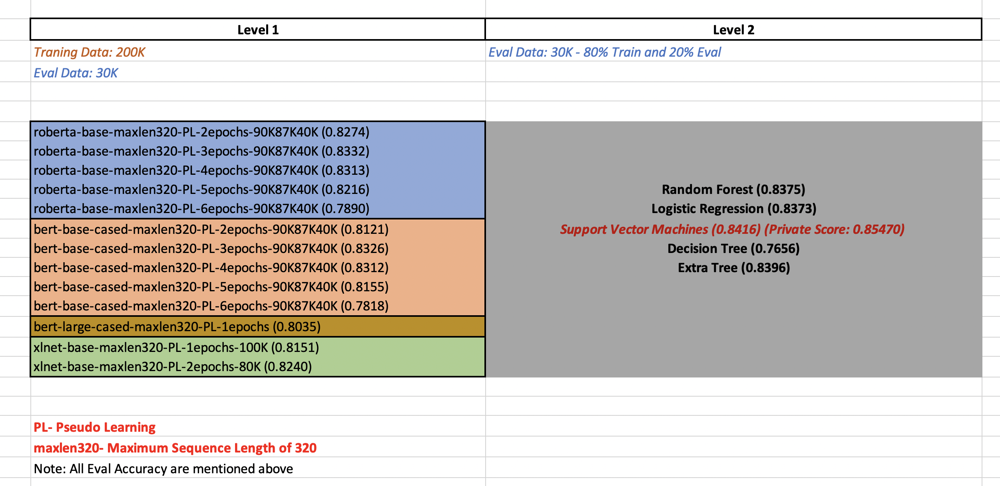

# Ensemble All You Need

### Data Exploration
* exploration/Exploration using nlp_profiler.ipynb
* exploration/Language Exploration.ipynb

### Modeling
* model_nbs/MachineHack_bert_base.ipynb
* model_nbs/MachineHack_Distilbert.ipynb
* model_nbs/MachineHack_ELECTRA.ipynb
* model_nbs/MachineHack_roberta_base.ipynb
* model_nbs/MachineHack_xlnet.ipynb
* ensemble.py

### Final Model Architecture
